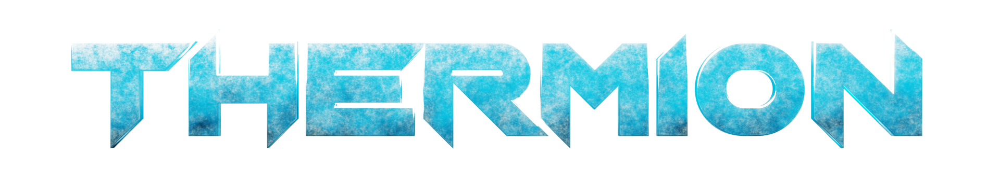

<p align="center">
  <a href="https://thermion.dev/quickstart">Quickstart (Flutter)</a> •
  <a href="https://thermion.dev/">Documentation</a> •
  <a href="https://thermion.dev/showcase">Showcase</a> •
  <a href="https://dartpad.thermion.dev/">Playground</a> •
  <a href="https://discord.gg/h2VdDK3EAQ">Discord</a>
</p>

## Cross-platform 3D toolkit for Dart and Flutter.

<a href="https://pub.dev/packages/thermion_dart"></a>
<a href="https://github.com/nmfisher/thermion"></a>
<a href="https://discord.gg/h2VdDK3EAQ"></a>
<a href="https://github.com/nmfisher/thermion"></a>


https://github.com/user-attachments/assets/b0c07b5a-6156-4e42-a09b-5f9bd85fbf32


### Features

- Supports iOS (arm64), MacOS (arm64/x64), Android (arm64), Windows (x64) (>= 10), Web/WASM 
- glTF, KTX, PNG & JPEG texture support
- camera/entity manipulation with mouse (desktop) and gestures (mobile)
- skinning + morph animations

Uses the Filament PBR engine (currently v1.56.4).

### Quickstart (Flutter)

From the command line:

```bash
flutter channel master
flutter upgrade
flutter config --enable-native-assets  
```

In your Flutter app:

```dart
_thermionViewer = await ThermionFlutterPlugin.createViewer();

// Geometry and models are represented as "entities". Here, we load a glTF
// file containing a plain cube.
// By default, all paths are treated as asset paths. To load from a file 
// instead, use file:// URIs.
var entity =
    await _thermionViewer!.loadGlb("assets/cube.glb", keepData: true);

// Thermion uses a right-handed coordinate system where +Y is up and -Z is
// "into" the screen.
// By default, the camera is located at (0,0,0) looking at (0,0,-1); this
// would place it directly inside the cube we just loaded.
//
// Let's move the camera to (0,0,10) to ensure the cube is visible in the
// viewport.
await _thermionViewer!.setCameraPosition(0, 0, 10);

// Without a light source, your scene will be totally black. Let's load a skybox
// (a cubemap image that is rendered behind everything else in the scene)
// and an image-based indirect light that has been precomputed from the same
// skybox.
await _thermionViewer!.loadSkybox("assets/default_env_skybox.ktx");
await _thermionViewer!.loadIbl("assets/default_env_ibl.ktx");

// Finally, you need to explicitly enable rendering. Setting rendering to
// false is designed to allow you to pause rendering to conserve battery life
await _thermionViewer!.setRendering(true);
```

and then in your widget tree:
```dart
 @override
  Widget build(BuildContext context) {
    return Stack(children: [
      if (_thermionViewer != null)
        Positioned.fill(
            child: ThermionWidget(
          viewer: _thermionViewer!,
        )),
    ]);
  }
```

### Sponsors, Contributors & Acknowledgments

Thermion uses the [Filament](https://github.com/google/filament) Physically Based Rendering engine under the hood.

Special thanks to [odd-io](https://github.com/odd-io/) for sponsoring work on supporting Windows, raycasting, testing and documentation.

Thank you to the following people:

- @Hannnes1 for help migrating to `native-assets`
- @jarrodcolburn for documentation contributions
- @daverin for MacOS library contributions
- @LukasPoque for CI/refactoring work
- @alexmercerind for his work on integrating ANGLE textures on Flutter Windows

