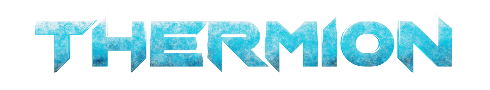

<p align="center">
  <a href="https://thermion.dev/quickstart">Quickstart (Flutter)</a> •
  <a href="https://thermion.dev/">Documentation</a> •
  <a href="https://thermion.dev/showcase">Showcase</a> •
  <a href="https://dartpad.thermion.dev/">Playground</a> •
  <a href="https://discord.gg/h2VdDK3EAQ">Discord</a>
</p>

## Cross-platform 3D toolkit for Dart and Flutter.

<a href="https://pub.dev/packages/thermion_dart"></a>
<a href="https://github.com/nmfisher/thermion"></a>
<a href="https://discord.gg/h2VdDK3EAQ"></a>
<a href="https://github.com/nmfisher/thermion"></a>

https://github.com/user-attachments/assets/b0c07b5a-6156-4e42-a09b-5f9bd85fbf32

### Features

- Supports iOS (arm64), MacOS (arm64/x64), Android (arm64), Windows (x64) (>= 10), Web/WASM 
- glTF, KTX, PNG & JPEG texture support
- camera/entity manipulation with mouse (desktop) and gestures (mobile)
- skinning + morph animations

Uses the Filament PBR engine (currently v1.56.4).

### Quickstart (Flutter)

From the command line:

```bash
flutter channel master
flutter upgrade
flutter config --enable-native-assets  
```

In your Flutter app:

```dart
@override
  Widget build(BuildContext context) {
    return Scaffold(
        body: Stack(children: [
        Positioned.fill(
            child: ViewerWidget(
          assetPath: "assets/cube.glb",
          skyboxPath: "assets/default_env_skybox.ktx",
          iblPath: "assets/default_env_ibl.ktx",
          transformToUnitCube: true,
          initialCameraPosition: Vector3(0, 0, 6),
          background: Colors.blue,
          manipulatorType: ManipulatorType.ORBIT,
          onViewerAvailable: (viewer) async {
            await Future.delayed(const Duration(seconds: 5));
            await viewer.removeSkybox();
          },
          initial: Container(
            color: Colors.red,
          ),
        ))]));
  }
```

> the first time you build an app that consumes this package, the Dart native-assets build system will download static binaries from Cloudflare. This may take a few minutes (depending on which platform you are compiling for). These will be cached, so subsequent builds will be much faster.

### Web

Web builds need two files (`thermion_dart.js` and `thermion_dart.wasm`) sitting alongside your app's `web/index.html`. In the normal case, `thermion_dart`'s build hook fetches them for you on `flutter run`/`flutter build web` — no extra step required:

```bash
flutter build web
```

The hook reads `native/web/web.version`, downloads the matching artifacts from Cloudflare R2, caches them under `.dart_tool/thermion_dart/web/<sha>/`, and copies them into your app's `web/` directory. Subsequent builds are instant unless the version changes.

If you want to fetch them ahead of time (e.g. for an offline build), you can do so manually:

```bash
dart run thermion_dart:download_web            # → ./web/
dart run thermion_dart:download_web -o custom  # → custom/
```

#### Iterating on native C++ against web

If you're modifying `thermion_dart`'s native code and want to test on web without bumping `native/web/web.version` and waiting for CI to rebuild the R2 artifacts, build the emscripten target locally and opt in via your app's `pubspec.yaml`:

```yaml
hooks:
  user_defines:
    thermion_dart:
      web_local: true
```

```bash
# Build the wasm (from native/web/build):
emcmake cmake ..
emmake make

# Then run/build your Flutter app:
flutter run -d chrome
```

When set, the build hook copies `thermion_dart.{js,wasm}` from `thermion_dart/native/web/build/build/out/` into your app's `web/` directory instead of downloading from R2. Remove the flag (or set it to `false`) to go back to the pinned prebuilt.

### Sponsors, Contributors & Acknowledgments

Thermion uses the [Filament](https://github.com/google/filament) Physically Based Rendering engine under the hood.

Special thanks to [odd-io](https://github.com/odd-io/) for sponsoring work on supporting Windows, raycasting, testing and documentation.

Thank you to the following people:

- [@Hannnes1](https://github.com/Hannnes1) for help migrating to `native-assets`
- [@jarrodcolburn](https://github.com/jarrodcolburn) for documentation contributions
- [@daverin](https://github.com/daverin) for MacOS library contributions
- [@LukasPoque](https://github.com/LukasPoque) for CI/refactoring work
- [@alexmercerind](https://github.com/alexmercerind) for his work on integrating ANGLE textures on Flutter Windows
- [@BrutalCoding](https://github.com/BrutalCoding) for documentation fixes
- [@chenriji](https://github.com/chenriji) for testing and bug fixes
- [@JesperBellenbaum](https://github.com/JesperBellenbaum) for Vulkan/Windows improvements
- [@repentsinner](https://github.com/repentsinner) for Linux/EGL/Windows stability + improvements
- [@mwahnish](https://github.com/mwahnish) for bug fixes and web improvements
