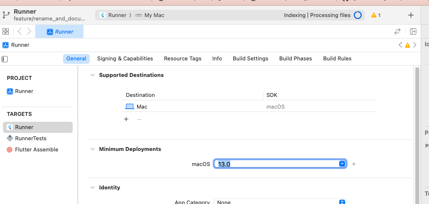
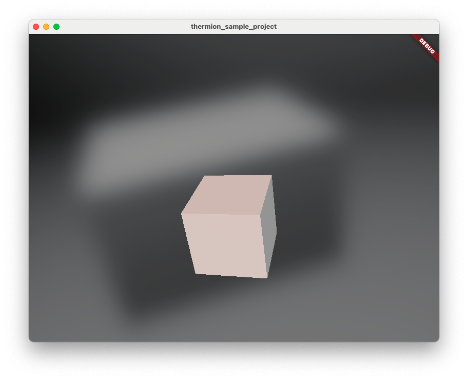

## Quickstart (Flutter)

> You can find the entire project below in the [flutter/quickstart](https://github.com/nmfisher/thermion_examples/tree/master/flutter/quickstart) folder of the `thermion_examples` repository.

1. Switch to Flutter master channel, upgrade Flutter, create a new project, then add `thermion_flutter` as a dependency

```bash
$ flutter channel master
$ flutter upgrade
$ flutter config --enable-native-assets  
$ flutter create thermion_sample_project && cd thermion_sample_project
$ flutter pub add thermion_flutter
```

2. If running on iOS or MacOS, change the minimum deployment target to OSX 13

<Accordion title="Click to open iOS/MacOS instructions">

Make sure the `platform` entry refers to `13.0` in your Podfile.

In `macos/Podfile` (for macOS):
```
platform :osx, '13.0'
```

In `ios/Podfile`, (for iOS):
```
platform :ios, '13.0'
```

Then open XCode:
```
open macos/Runner.xcworkspace
```

and change the minimum deployment target to 13.0:



</Accordion>

<Accordion title="Click to open Windows instructions">
See the [/windows](Windows) page for steps needed to build on Windows.
</Accordion>


2. Add a folder containing your assets (glTF model + skybox ktx) to your `pubspec.yaml` asset list

```yaml
...
flutter
  uses-material-design: true
  assets:
    - assets/
```

3. Create an instance of `ThermionFlutterPlugin` in your app.

```dart

class _MyAppState extends State<MyApp> {
  late ThermionFlutterPlugin _thermionFlutterPlugin;  
  late Future<ThermionViewer> _thermionViewer;
  void initState() {    
    _thermionFlutterPlugin = ThermionFlutterPlugin();    
    _thermionViewer = _thermionFlutterPlugin.createViewer();  
  }
}

```


4. Add a `ThermionWidget` to your widget hierarchy 

```dart

class _MyAppState extends State<MyApp> {
    
    ThermionViewer? _thermionViewer;
    void initState() {    
        _thermionFlutterPlugin.createViewer().then((viewer) {
            setState(() {
                _thermionViewer = viewer;
            });
        });
    }    

    Widget build(BuildContext context) {
        return Stack(children:[
            if(_thermionViewer != null)
            Positioned.fill(
                child:ThermionWidget(
                    plugin:_thermionViewer!
                ) 
            )
        ]);  
    }
}

```

4. Add a button to load the model when pressed

```dart

...

class _MyAppState extends State<MyApp> {
    
...
    
    bool _loaded = false;

    Widget build(BuildContext context) {
        return Stack(children:[
            if(_thermionViewer != null)
            Positioned.fill(
                child:ThermionWidget(
                    plugin:_thermionViewer!
                ) 
            ),
            if (!_loaded)
                Center(
                    child: ElevatedButton(
                        child: const Text("Load"),
                        onPressed: () async {
                            // TODO 
                            _loaded = true;
                            setState(() {});
                        }))
        ]);  
}}
```

5. When the button is pressed, load a skybox, lighting and the glb asset

You will need to import the `dart:math` and `package:vector_math` libraries.

```dart
import 'package:vector_math/vector_math_64.dart' as v;
import 'dart:math';

...

class _MyAppState extends State<MyApp> {

    ...

    Widget build(BuildContext context) {
        return Stack(children:[
            ...
            if(!_loaded)
                Center(
                    child: ElevatedButton(
                        child: const Text("Load"),
                        onPressed: () async {
                            var viewer = await _thermionViewer;
                            await viewer.loadIbl("assets/default_env_ibl.ktx");
                            await viewer.loadSkybox("assets/default_env_skybox.ktx");
                            await viewer.loadGlb("assets/cube.glb");

                            await viewer.setCameraPosition(0, 1, 10);
                            await viewer.setCameraRotation(v.Quaternion.axisAngle(
                                    v.Vector3(1, 0, 0), -30 / 180 * pi) *
                                v.Quaternion.axisAngle(v.Vector3(0, 1, 0), 15 / 180 * pi));
                            await viewer.addLight(
                                LightType.SUN, 7500, 50000, 0, 0, 0, 1, -1, -1);
                            await viewer.setRendering(true);
                            _loaded = true;
                            setState(() {});
                        }
                    )
                )
        ]);
    }
}
```           

Here, we've added a skybox (the background (cube) image rendered behind all other elements in the scene), image-based lighting (where an image is used to determine the direction and intensity of a light source) and a directional light (Sun).

Anything added to the scene is referred to as an "entity" (including lights and cameras).

Entities are always added to the scene at position (0,0,0).

The default scene camera is located at (0,0,0) (and is looking at -Z, or "into" the screen), so by adding a cube at (0,0,0), the camera will now be inside the cube. 

We need to move the camera outside the cube so it's visible. 

6. Change the camera orientation
```dart
   var viewer = await _thermionViewer;
    await viewer.loadSkybox("assets/default_env_skybox.ktx");
    await viewer.loadGlb("assets/cube.glb");

    await viewer.setCameraPosition(0, 1, 10);
    await viewer.setCameraRotation(v.Quaternion.axisAngle(
                        v.Vector3(1, 0, 0), -30 / 180 * pi) *
                    v.Quaternion.axisAngle(v.Vector3(0, 1, 0), 15 / 180 * pi));
```

The cube still won't be visible until we add a light to the scene and tell Thermion to start rendering.

7. Add a light and turn rendering on
```dart 
    ...
    await viewer.addLight(
                    LightType.SUN, 7500, 50000, 0, 0, 0, 1, -1, -1);
    await viewer.setRendering(true);
    ...
````

8. Run the project
```
$ flutter run -d macos
```

> You may experience a noticeable delay the very first time you run the project. Don't panic, it's not frozen! This is due to the build system downloading the prebuilt Filament binaries from Cloudflare, which can take some time (particularly on Windows). These binaries will be cached after first download, so subsequent runs will be much faster (though every time you run flutter clean, the binaries will be re-downloaded).



Your first Thermion project is complete!