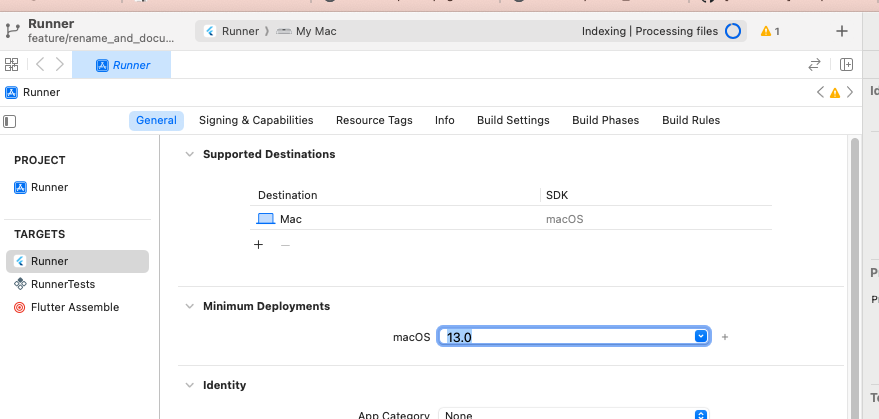

## Windows

2. If running on iOS or MacOS, change the minimum deployment target to OSX 13

<Accordion title="Click to open iOS/MacOS instructions">

Make sure the `platform` entry refers to `13.0` in your Podfile.

In `macos/Podfile` (for macOS):
```
platform :osx, '13.0'
```

In `ios/Podfile`, (for iOS):
```
platform :ios, '13.0'
```

Then open XCode:
```
open macos/Runner.xcworkspace
```

and change the minimum deployment target to 13.0:



</Accordion>

<Accordion title="Click to open Windows instructions">
If you're running Windows, delete the `examples/flutter/quickstart/assets` symlink and copy the `assets` folder from `examples/assets` to `examples/flutter/quickstart/assets`.
</Accordion>