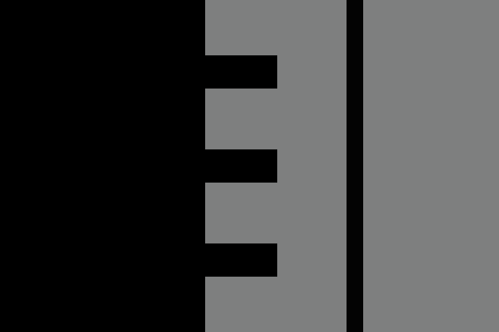
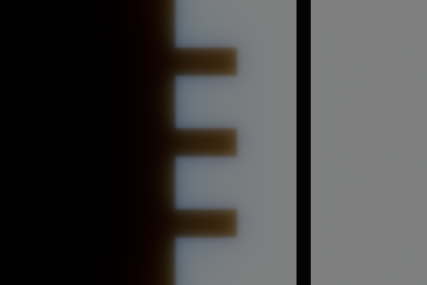

# Cycles reference for Burley screen-space diffusion

This directory preserves the SSS comparison scripts and compact capture evidence.
The actual renderer outputs in `samples/` are unmodified PNGs and linear row data.
No EXRs, compiled libraries, packed scenes or machine-specific build paths are
committed. Generated outputs are ignored and can be recreated.

## View the existing captures

From this directory, with Python 3 and Pillow installed:

```sh
python3 build_burley_report.py
python3 build_visible_demo.py
```

Open `comparison-burley.html` for the matched ball and flat-surface comparisons,
or `visible-demo.html` for the clearer Cycles shadow-and-paint demonstration.
Both viewers embed PNGs and work offline. The latter has alternating off/on and
hold-to-view-off controls, with 0.6 mm and exaggerated 2 mm settings.




The dark teeth are cast shadows; the straight stripe is paint. Scattering softens
the shadow boundary while preserving the painted edge. This close-up spans
90 × 60 mm. It demonstrates Cycles; Thermion has not rendered this new stencil
scene. Its separate matched flat-boundary and sphere fixtures are in the first
viewer.

## Model and evidence

All current Cycles renders use Blender 4.5.0 Burley. Distances are the exponential
profile length d, with RGB ratios 1 : 0.5 : 0.25 on the balls and stencil. The live
[Cycles radius setup](https://github.com/blender/blender/blob/v4.5.0/intern/cycles/kernel/closure/bssrdf.h)
scales Burley node radius × scale by 1/(4π), so the scripts set that product to
4πd. Both implementations use the normalized 16d-truncated radial profile. The
older albedo-dependent Burley setup helper is not called by this setup path.
There is no fit of radii or shadow-edge positions to the Thermion captures.

The ball is 100 mm in radius. Its red-channel texture transition stays near
2.66 px in Thermion and 2.76 px in Cycles with SSS off/on. The matched flat-shadow
curves differ by at most 1.852% of each renderer's unscattered contrast for
6.25 mm, and 1.436% for 12.5 mm. Sampling conventions differ: Cycles averages the
output pixel area, whereas Thermion gathers at pixel centers from its original
PCF-filtered lighting. These measurements do not establish equivalence on curved,
hidden or offscreen surfaces or validate a measured skin preset.

Capture provenance: Apple M2 Pro / Metal for Thermion, Cycles CPU for Blender,
2026-09-17. The ball uses 2,048 samples per pixel; matched flat fixtures use 4,096;
the visible stencil uses 1,024. No denoising or sharpening is applied. The PNGs
share Filament's ACES display transform; matched flat diagnostics ending in
`_linear.png` instead show linear RGB directly in both engines. Raw center rows
remain linear. `samples/previous-gaussian/` preserves the rejected prototype's
0.6/1.2 mm sigma ball renders solely for the historical comparison.

**Current Thermion acceptance is 18/19.** The strict indirect-specular-only test
still changes five pixels with geometric specular AA when enabling SSS, including
an unselected-material diagnostic. The failure is retained, not tolerated away.
Matching engine artifacts are not published; this is draft work.

## Reproduction

Use the matching Filament branch described in
[the implementation notes](../../../docs/screen-space-subsurface-scattering.md).
Stage it and run Thermion captures from `thermion_dart`:

```sh
python3 tool/sss_local.py /path/to/filament --test
```

The current full GPU suite exits nonzero for the documented reflection failure,
but writes the completed captures and `test/output/sss_replacement/audit.json`.
From this directory, build the display-only helper (tested on macOS arm64):

```sh
python3 build_display.py /path/to/filament
```

With Blender 4.5 on PATH, recreate the procedural sphere scene, the references,
and the stencil demonstration:

```sh
blender --background --factory-startup --python create_sphere_scene.py
blender --background --factory-startup --python render_model_reference.py -- --samples 4096
blender --background --factory-startup --python render_model_reference.py -- --sphere --samples 2048
blender --background --factory-startup --python render_sss_demonstration.py
```

Blender supplies `bpy` and NumPy. The display helper uses Filament's existing tone
mapper, not its SSS implementation. It exports common-ACES PNGs from the saved
linear EXRs. Packed scenes are saved locally; Blender's interactive Standard
view transform differs from the exported PNG display transform.

To compare newly generated outputs instead of the recorded snapshots:

```sh
python3 build_burley_report.py --thermion-output ../../test/output --cycles-output burley-reference
python3 build_visible_demo.py --renders visible-demo
```

The original measurements in `samples/` are never overwritten by these commands.
